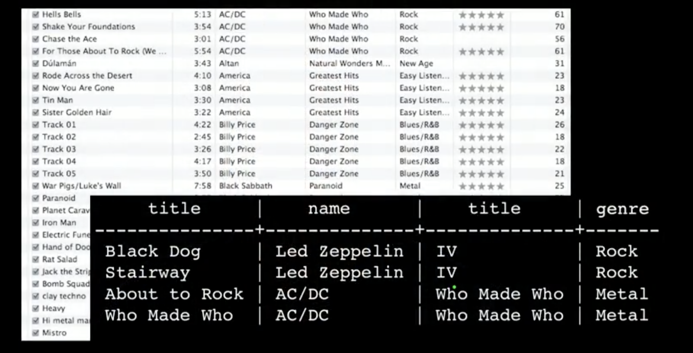

# PostgreSQL-for-Everybody-Specialization

This repository contains SQL queries for creating and populating a music database, designed as part of the PostgreSQL for Everybody Specialization offered by Dr. Chuck.

## Table Creation

The following SQL statements create the necessary tables for the music database:

```sql
CREATE TABLE artist (
  id SERIAL,
  name VARCHAR(128) UNIQUE,
  PRIMARY KEY (id)
);

CREATE TABLE album (
  id SERIAL,
  title VARCHAR(128) UNIQUE,
  artist_id INTEGER REFERENCES artist(id) ON DELETE CASCADE,
  PRIMARY KEY(id)
);

CREATE TABLE genre (
  id SERIAL,
  name VARCHAR(128) UNIQUE,
  PRIMARY KEY(id)
);

CREATE TABLE track (
  id SERIAL,
  title VARCHAR(128),
  len INTEGER,
  rating INTEGER,
  count INTEGER,
  album_id INTEGER REFERENCES album(id) ON DELETE CASCADE,
  genre_id INTEGER REFERENCES genre (id) ON DELETE CASCADE,
  UNIQUE(title, album_id),
  PRIMARY KEY (id)
);
```

## Populating the Database (Example Data)

These SQL statements demonstrate data insertion.
Replace this example data with your own.  
album_id and genre_id must reference existing ids 
in the album and genre tables, respectively, to avoid errors.

```sql
-- Insert Artists
INSERT INTO artist (name) VALUES ('Led Zeppelin');
INSERT INTO artist (name) VALUES ('AC/DC');
INSERT INTO artist (name) VALUES ('Deep Purple');

-- Insert Genres
INSERT INTO genre (name) VALUES ('Rock');
INSERT INTO genre (name) VALUES ('Metal');
INSERT INTO genre (name) VALUES ('Hard Rock');

-- Insert Albums (referencing artists by ID)
INSERT INTO album (title, artist_id) VALUES ('Led Zeppelin IV', 1);
INSERT INTO album (title, artist_id) VALUES ('Who Made Who', 2);
INSERT INTO album (title, artist_id) VALUES ('Machine Head', 3);

-- Insert Tracks (referencing albums and genres by ID)
INSERT INTO track (title, rating, len, count, album_id, genre_id)
VALUES ('Black Dog', 5, 297, 0, 1, 1);
INSERT INTO track (title, rating, len, count, album_id, genre_id)
VALUES ('Stairway to Heaven', 5, 482, 0, 1, 1);
INSERT INTO track (title, rating, len, count, album_id, genre_id)
VALUES ('About to Rock', 5, 313, 0, 2, 2);
INSERT INTO track (title, rating, len, count, album_id, genre_id)
VALUES ('Who Made Who', 5, 207, 0, 2, 2);
INSERT INTO track (title, rating, len, count, album_id, genre_id)
VALUES ('Smoke on the Water', 5, 300, 0, 3, 3);

-- Add more INSERT statements as needed.
```


## How to Use

1. **Clone:** Clone this repository.
2. **Connect:** Connect to your PostgreSQL database using `psql` or a database management tool.
3. **Execute SQL:**
    * **Copy/Paste:** Copy and paste SQL code into `psql`. Press Enter to execute.
    * **SQL Script:** Save SQL code to a file (e.g., `music_database.sql`). In `psql`, use `\i music_database.sql`.
4. **Verify:** Use `SELECT` statements to check the tables and data. For example:

```sql
SELECT * FROM artist;
SELECT * FROM album;
SELECT * FROM genre;
SELECT * FROM track;
```

## SQL Query with JOINs

The following SQL query demonstrates how to use JOINs to retrieve data from multiple related tables in a music database.

```sql
SELECT track.title, artist.name, album.title, genre.name
FROM track
JOIN genre ON track.genre_id = genre.id
JOIN album ON track.album_id = album.id
JOIN artist ON album.artist_id = artist.id;
```
Result
The query returns a table with the track title, artist name, album title, and genre name for each track.

| title         | name          | title         | name   |
|---------------|---------------|---------------|--------|
| Black Dog     | Led Zeppelin  | IV            | Rock   |
| Stairway      | Led Zeppelin  | IV            | Rock   |
| About to Rock | AC/DC         | Who Made Who  | Metal  |
| Who Made Who  | AC/DC         | Who Made Who  | Metal  |



## Important Notes
Order: Execute CREATE TABLE before INSERT. Insert into artist and genre before album and track (due to foreign keys).
Data Types: Ensure data types match. Strings are in single quotes (e.g., 'Artist Name'), numbers are not.
Foreign Keys: album_id and genre_id in track must reference valid ids in album and genre.
ON DELETE CASCADE: Deleting an artist deletes related album and track rows automatically.
Customization: Modify table/column names, data types, and constraints as needed.

## Acknowledgements
Inspired by the PostgreSQL for Everybody Specialization by Dr. Chuck.  Grateful for his teaching and resources.